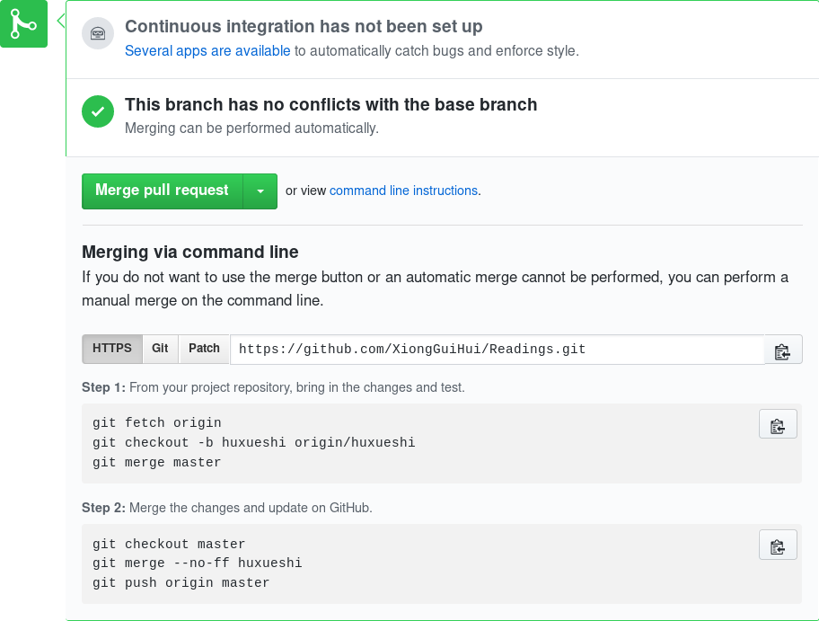

# Share your ideas

## contents
1. [Prerequisite](#prerequisite)
2. [Getting Started](#getting-started)
3. [Contribute](#contribute)

## Prerequisite
1. familiar with `markdown`
    1. `pdf` and `Microsoft word` are great, but they are binary file which make it impossible to modify.
    2. markdown is well supported by github
2. basic understanding of `git` and `github`
    2. [Chinese tutorial](https://github.com/geeeeeeeeek/git-recipes)
    3. [Desktop Application for learning git and github](https://github.com/jlord/git-it-electron)
    4. [liaoxuefeng](https://www.liaoxuefeng.com/)

## Getting started

### For member in XiongGuiHui

#### Set up environment
1. clone this repo
```
git clone https://github.com/XiongGuiHui/Readings
```
2. create a branch [ref](https://github.com/Kunena/Kunena-Forum/wiki/Create-a-new-branch-with-git-and-manage-branches)
```
git checkout -b yourname
# The parameter **yourname** can be chosen arbitrarily, but shoule be different from others.

```
3. set upstream
```
git push --set-upstream origin yourname
```

#### contribute to master branch
0. add and commit your changes
```
git add .
git commit -m "commit message"
```
1. push to your branch
```
git push origin yourname # yourname is branch name
```
2. this button will automatically appear on the github 

3. press the button and you can see things as below 

### For everyone wanna commit
Refer [this](https://github.com/firstcontributions/first-contributions).


## Contribute
For every paper, a **master copy** and several **slaves copies** are created fot it
```
|-- shared_memory_consistency_models:_a_tutorial.md <---- master copy
|-- src
|   `-- huxueshi <------- your name
|       `-- shared_memory_consistency_models:_a_tutorial.md <---- slave copy
|       `-- Intel_Haswell <---- slave copy
|           `-- Intel_Haswell_reading_notes.md
|           `-- figure_a.png 
|           `-- figure_b.md

```

### Slave copy
0. slave copy is place at /src/username/[dir]/\<filename\>
1. slave copy is your personal readings notes, nobody should modify it.
2. slave copy can be a directory or just a file.

### Master copy
1. master copy is place at top directory
2. master copy's file name should be lowercase and separated by `_`.
    1. white space make shell script handling files much more difficult to write
3. If master copy have images, you should create a directory under **./img** and put them into it.
```
├── img
│   └── amd-opteron
│       ├── 6472c4ccga3729112ca33&690.png
│       ├── Directory.jpg
│       ├── Dragon.jpg
│       ├── MEI.jpg
│       ├── MESI.jpg
│       ├── MOESI.jpg
│       └── transition.jpg
```
### Other Regulation
1. **Don't put the original paper into this repository**, a hyperlink is enough
    1. As for how to share the paper, @xieby1 is developing.


##### Discuss question
1. Any question, create a issue.
2. English is recommended if it can be expressed clearly.


