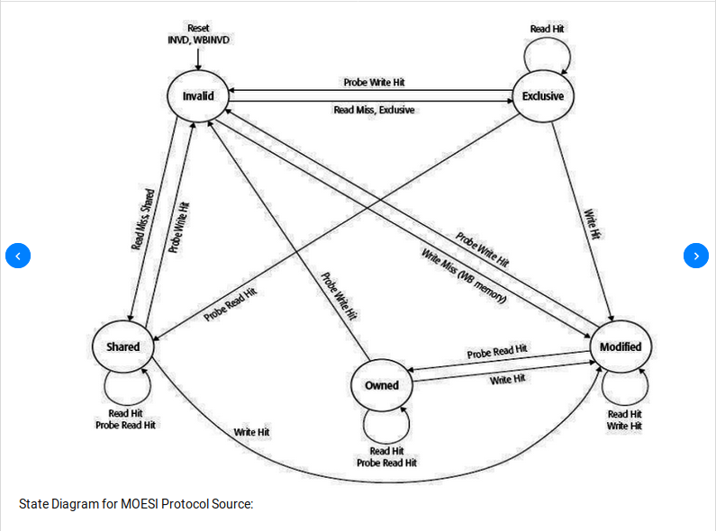

# cache hierarchy and memory subsystem of amd opteron processor

# 1.Abstract

# 2.Processor Overview

### 2.1 "Magny Cours" die(node)

每个核有独立的指令缓存和数据缓存，每个的大小为64kB，下一级为片上的512kB的L2缓存。每个缓存（包括L3）的缓存行大小为64B。L1缓存为2路组相联，load-to-use的延迟为3时钟周期。L2缓存为16路组相联，load-to-use的延迟为12时钟周期。L1缓存和L2缓存采用不相容策略：L2缓存保存L1中被替换出的行，L2中命中的行被无效然后放到L1缓存中。

该处理器的实现允许探测过滤器在多处理器配置下enable，在不需要它的单处理器的桌面和工作站配置下disable。

探测过滤器也叫做HyperTransport Assit或者HT Assit。它有两个好处：1.保留系统带宽，2.降低访存延迟。

### 2.2 MCM package

### 2.3 2P/4P blade architectures

### 2.4 Configurable L3 cache

##### 2.4.1 L3 cache organization

L3 cache保留从L2 cache中被替换出的行。6MB的L3缓存由两个1MB和两个2MB的16路组相联的子缓存组成。缓存探测操作可以并行地在所有子缓存上执行，或者被限制到一个明确的基于地址的子集。缓存行被分配到可用的子缓存，导致了基于地址的限制和对索引集中含有无效项的子缓存的偏爱。如果没有无效的路，那么一个与它们的大小成比例的加权轮询调度算法分配缓存行。在一个有效的替换，首先选择保存替换行的子缓存（使用加权轮询调度），然后应用一个假的LRU算法在16路相关子缓存中选择保存替换行的缓存行。

>>>>>>> The L3 cache allocates lines to an available subcache, accounting for any address-based restrictions and giving preference to any subcache containing, invalid entries in the indexed set. 翻译不对

>>>>>>> L3 subcache的使用和淘汰策略，L3 是victim cache


缓存支持”直接寻址“模式，在该模式下L3可以基于地址分片。在该模式下，分配的行和探头基于对地址位的哈希被导向一半的缓存（一对子缓存）。这样可以降低功耗并有可能降低延迟。每个tag探头ties up一部分缓存的资源，这允许更多的投机的读取并行地发射。然而，一些应用可能对该模式下降低的有效关联性敏感，所以这个益处是依赖于工作负载种类的。

>>>>>>>> 

L3作为一个victim的优点是降低了L2和L3 cache的内容重复，允许更多数据被缓存。另外，当L3缓存行被替换出去时不用再无效L2 cache中的缓存行。当L3一个缓存行被检测为true sharing时，那么当L3提供该行的副本给请求的核时，L3 缓存可以保留该行。如果下次读来自分配该L3缓存行的核，那么这个数据被认为是私有的并且L3不保存一个副本，而是把该行送回到core负责，设置该行为E或者M状态，然后无效L3缓存中的该行。否则，如果和core请求类型一致，L3会继续保留副本，因为预期会有share。这个机制允许一个core替换出E和M状态的行，然后以相同状态保留在L3缓存，如果没有被共享的话。

>>>>>>  If the next read is from the same core that allocated the L3 line, the data is deemed private。
的暂时理解是：如果read from other core, 那么该L3 line 就是share 的状态，如果core B写，那么core B 负责设置该行为E 或者M。


##### 2.4.2 Sub-Cache optimization

控制信号到数据区域和读数据返回路径都流水线化，导致到后继区域的round-trip延迟增加了一个时钟周期。因此，子缓存可以提供4个连续的128位值，即使最后一个值可能在一个离tag很远的位置。

>>>>>>　The data array within the subcache is divided into four regions, each providing 128 bits of data. 什么是data array, 只有16byte吗?为什么会导致round-trip 增加一个cycle ？ 为什么可以提供四个连续的128 bit ?


##### 2.4.3 Latency optimation

L3缓存架构动态地优化延迟和带宽。当缓存被lightly加载时，它处于延迟降低模式，在该模式下，处理器发起的tag探测假定命中并且需要的数据总线和buffer提前保留。这样允许tag探测的结果直接读数据宏并且减小延迟。然而，当请求频率很高并且L3不包含足够的资源，请求被发送到tags作为”query only“，这会决定缓存状态而不发起一个数据传输。如果该行不在cache中，请求会以最小延迟发到DRAM。否则，包含该行的L3 数据读命令被发送到子缓存中一旦需要的资源可用。

>>>>>> 什么是 processor-initiated tag probe ? 即使是预留了空间， 也是无法实现read of the data macro to be overlapped with the tag probe ?无法理解两种状态的区别，L3 cache contains enough resource 指的是什么resource ?

##### 2.4.4 Bandwidth

L3 cache controller 可以在每一个时钟发出 `processor-initiated tag probe` 或者 `tag update` 和 `one probe-initiated tag probe` 或者 `tag update`


```
两种probe 的含义是是什么，
```


##### 2.4.5 coherency
L3 cache performs collision detection 防止probe 和 数据传输的碰撞。 L3 实现`block aggressive neighbor` 来避免在multiprogramming 环境下，poor caching charactreristic 的程序，影响其他的core 的程序的执行。

### 3 Memory controller and DRAM interface

# 3 Cache coherence protocal 
[CMP](https://en.wikipedia.org/wiki/Multi-core_processor): Chip MultiProcess 
[ECC](https://en.wikipedia.org/wiki/ECC_memory):Error-correcting code memory

Broadcast-based protocal: simplicity , low latency, but high interconnection and probe bandwidth
Directory-based protocal: scale up to larger systems, but complex and difficult to verify
HT assist is a key innovation, without using DRAM-based directory nad maintains low indirection latency

### 3.1 Review of broadcast protocal
home node: where DRAM for the requested cache line resides

1. request becomes active
2. home node broadcast cache probe request to all processor and memory contoller initiates a DRAM access
3. all processor and DRAM response

### 3.2 HyperTransport Assist Directory protocal
Each home node keeps track of which cache lines from its memory are cached by other processors in the system.
```
既然同一条数据含有多个状态，那么数据旁边就是含有几个bit 表示状态位，home node 的directory 不应该包含数据的状态，只是包含该数据的持有者是谁就可以了。

为什么目录协议需要广播？
```

Time to access the proce filter and gengerate a directed probe is the indirection latency.
```
似乎很早之前本文就使用了 indirection latency, 但是此处才定义，那么之前的改词的含义是什么？
probe filter 到底是一个部件，一个协议，还是一个动作　？
```

HT Assist's transaction flow:
1. Initial requests travel to home node
2. memory controller oders and activates requests
3. begins DRAM access and probe filter looolup in parallel
4. directory look up complete
5. memory generate msg depending on directory state

Directed probes never request a DRAM response.
Broadcast probes guarantees that data will be return from the owner node.

For most requests, the directory state is immediately updated after the initial directory lookup based on the request type and
directory state. 有的情况下，写S-state
```
比如说 ？
```
Notably, external read probe requests must transition E-state cache lines to O-state, return data
to the requester, and send eviction notifications of E-state cache lines to the directory

```
完全无法理解这一个状态转换是什么原因
1. 为什么需要send eviction notification
2. 为什么会从O 状态　转化为 E 状态
```

### 3.2 Directory storage
Our design’s 64-byte cache line holds 16 directory entries, with 4 bytes per entry
organized as a four-entry four-way set associative array

A single directory entry can track multiple cached copied of a shared line.

By default, the basic input/output system
(BIOS) will allocate 1 Mbyte of the 6-Mbyte L3 cache to directory storage.
The directory holds 256k directory entries, which can cover 16 Mbytes of cache. This results in a
directory coverage ratio of 16 Mbytes/(0.5 Mbytes + 6 cores + 5-Mbyte L3), or 2.0,
which says there are at least twice as many directory entries in a system as cached lines,

从计算中间，每一个directory entry 对应为 64 byte 的数据的大小，也就是16 整型的大小。

### 3.3 Directory stats and transitions


##### 3.3.1 Directory Behavior
The directory supports the full MOESI protocol from all previous AMD Opteron processors

Although a downgrade probe does not block system activity for the demand request that caused it,
minimizing downgrades to achieve high probe filtering rates and processor-side cache perturbation is still important

```
什么是 processor-side cache perturbation
什么是 high probe filtering
```

Therefore, informing the directory on M, O, and E state castouts, in combination with directory size and
mapping, ensures that most directory miss requests find an available invalid directory location.

```
为什么告诉MOE 状态， directory size , mapping 就可以最大概率的知道invalid directory location.
```

# 辅助资料

### [MOESI](https://en.wikipedia.org/wiki/MOESI_protocol)
In addition to the four common MESI protocol states, there is a fifth **Owned** state representing data that is both modified and shared.
This avoids the need to write modified data back to main memory before sharing it.
While the data must still be written back eventually, the write-back may be deferred.

Unlike the MESI protocol, a shared cache line may be dirty with respect to memory; if it is, some cache has a copy in the Owned state, and that cache is responsible for eventually updating main memory If no cache hold the line in the Owned state, the memory copy is up to date


五种状态
1. Share: 多个copy, 有权修改
2. Own: 多个copy, 无权修改
3. modified: 只有一个copy, dirty
4. invalid: 无效，相当于不存在
5. Exclusive: 只有一个copy, clean

状态相容图:


状态转换图:




### [MESI](https://en.wikipedia.org/wiki/MESI_protocol)
The MESI protocol is an Invalidate-based which support write-back caches. 

```
那么invalidate-based 是什么意思啊 ？
有什么协议不支持write-back 的吗？
```

四种状态:
1. modified: one copy, dirty
2. exclusive: one copy, clean
3. shared: multiple copy, clean
4. invalid:

状态相容图:


状态的装换来自两种:
Processor Requests to Cache includes the following operations:
1. PrRd: The processor requests to read a Cache block.
1. PrWr: The processor requests to write a Cache block

Bus side requests are the following:
1. BusRd: Snooped request that indicates there is a read request to a Cache block made by another processor
1. BusRdX: Snooped request that indicates there is a **write request** to a Cache block made by another processor which doesn't already have the block.
1. BusUpgr: Snooped request that indicates that there is a write request to a Cache block made by another processor but that processor already has that Cache block resident in its Cache.
1. Flush: Snooped request that indicates that an entire cache block is written back to the main memory by another processor.
1. FlushOpt: Snooped request that indicates that an entire cache block is posted on the bus in order to supply it to another processor(Cache to Cache transfers).

### [Snooping](https://en.wikipedia.org/wiki/Bus_snooping)
For the snooping mechanism, a **snoop filter** reduces the snooping traffic by maintaining a **plurality** of entries, each representing a cache line that may be owned by one or more nodes. When replacement of one of the entries is required, the snoop filter selects for the replacement the entry representing the cache line or lines owned by the fewest nodes, as determined from a presence vector in each of the entries. A temporal or other type of algorithm is used to refine the selection if more than one cache line is owned by the fewest number of nodes.


There are two kinds of snooping protocols depending on the way to manage a local copy of a write operation: 
1. Write-invalidate: There are two kinds of snooping protocols depending on the way to manage a local copy of a write operation

2. When a processor writes on a shared cache block, all the shared copies of the other caches are updated through bus snooping
[Dragon](https://en.wikipedia.org/wiki/Dragon_protocol)和[Firefly](https://en.wikipedia.org/wiki/Firefly_(cache_coherence_protocol)

Implementation:


Benefit: fast
Drawback: limited scalability, so larger cache coherent NUMA (ccNUMA) systems tend to use directory-based coherence protocols.

Snoop filter:

the cache tag lookup by the snooper is usually an unnecessary work for the cache who does not have the cache block. But the tag lookup disturbs the cache access by a processor and incurs additional power consumption.

A snoop filter determines whether a snooper needs to check its cache tag or not.

A snoop filter is based on a directory based structure and **monitors** all coherent traffics in order to keep track of the coherency states of cache blocks. It means that the snoop filter knows the caches that have a copy of a cache block. Thus it can prevent the caches that do not have the copy of a cache block from making the unnecessary snooping. There are two types of filters depending on the location of the snoop filter. One is a **source filter** that is located at a cache side and performs filtering before coherent traffics reach the shared bus. The other is a **destination filter** that is located at a bus side and blocks unnecessary coherent traffics going out from the shared bus. The snoop filter is also categorized as **inclusive** and **exclusive**. The inclusive snoop filter keeps track of the presence of cache blocks in caches. However, the exclusive snoop filter monitors the absence of cache blocks in caches. In other words, a hit in the inclusive snoop filter means that the corresponding cache block is held by caches. On the other hand, a hit in the exclusive snoop filter means that no cache has the requested cache block.[4]

### [Directory](https://en.wikipedia.org/wiki/Directory-based_coherence)

Full bit vector format, for each possible cache line in memory, a bit is used to track whether every individual processor has that line stored in its cache.

Distributed shared memory (DSM) a.k.a. Non-Uniform Memory Access (NUMA)

A directory node keeps track of the overall state of a cache block in the entire cache system for all processors. It can be in three states :

1. Uncached (U): No processor has data cached, memory up-to-date .
2. Shared (S): one or more processors have data cached, memory up-to-date. In this state directory and sharers have clean copy of the cached block.
3. Exclusive/Modified (EM): one processor (owner) has data cached; memory out-of-date. Note that directory can not distinguish a block cached in an exclusive or modified state at the processor as processors can transition from an exclusive state to modified state with out any bus transaction.

```
我想知道，是不是directory protocal 绝对不会使用broadcast的。
```
