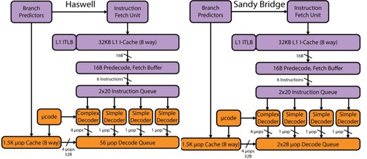
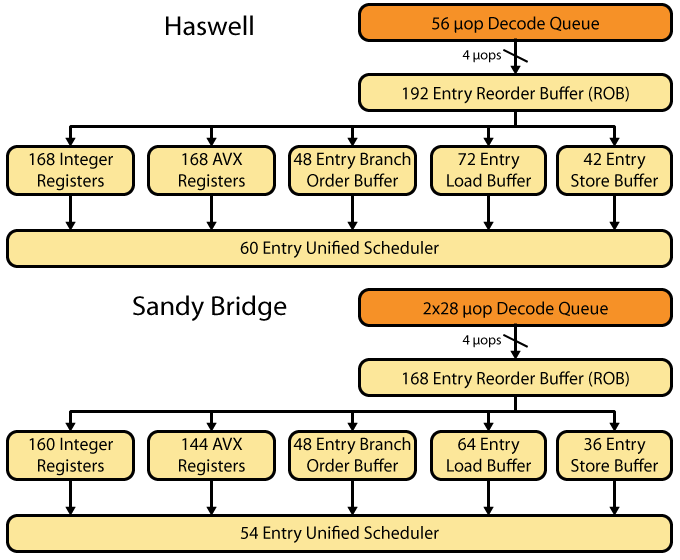
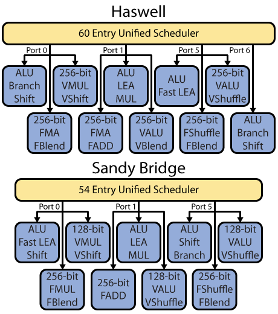
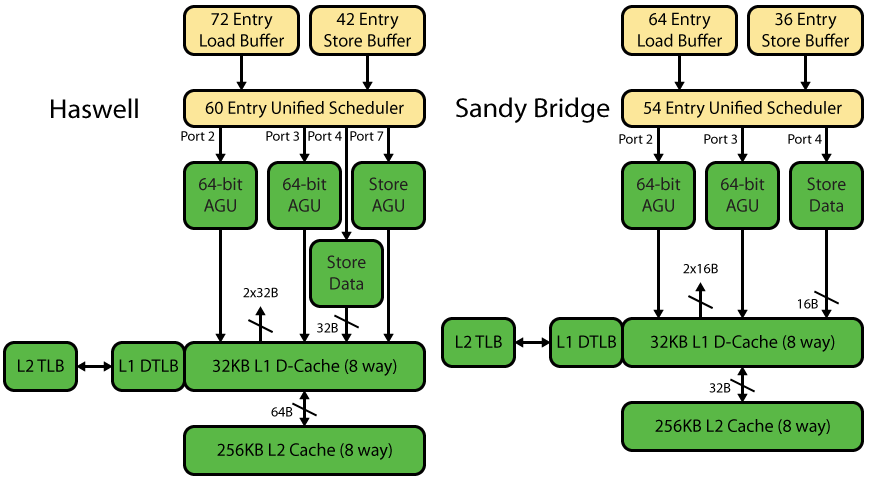
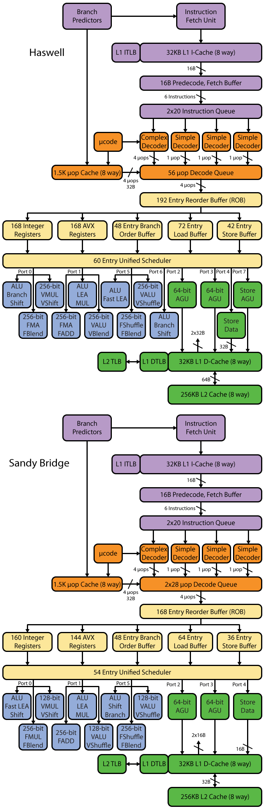

# Intel’s Haswell CPU Microarchitecture

### Overview

在过去的5年中，高性能微处理器发生了巨大变化。其中一个最重要的影响是摩尔定律提高了整合水平。在半导体的背景下，集成是一个永远存在的现实状况，降低系统功耗和成本，提高性能。这一趋势的最新体现是片上系统（SoC）理念和设计方法。 SoC一直是极低功耗系统的首选解决方案，例如1W手机芯片。

Sandy Bridge是英特尔新时代的曙光，也是第一款真正被称为SoC的高端x86微处理器，然而，Sandy Bridge主要针对传统的PC市场，而在嵌入式市场，它的前几次迭代表现不佳。

Haswell是第一个专为利用英特尔22纳米FinFET工艺技术而量身定制的SoC系列。Haswell CPU拥有大量的体系结构增强功能，其中四个扩展涉及x86指令集架构（ISA）的各个方面。 AVX2将整数SIMD带入256位向量，并为稀疏存储器访问添加了收集指令。融合的乘法 - 加法扩展提高了浮点（FP）工作负载的性能，例如科学计算，并且与新的收集指令很好地协同。少量位操作指令有助于加密，网络和某些搜索操作。最后，英特尔推出了TSX或事务内存，这是一种非常强大的并发和多线程编程编程模型。 TSX通过更好地利用底层多核硬件来提高软件的性能和效率。

英特尔的设计理念强调低功耗的卓越单核性能。新的Haswell核心实现了比Sandy Bridge更高的性能。Haswell微体系结构是一个双线程，无序微处理器，能够解码5个指令，发出4个融合的uop，每个周期发送8个uop。 Haswell核心是英特尔即将推出的SoC的基础，将用于从平板电脑到服务器，与AMD和各种基于ARM的SoC供应商竞争。

### Haswell Instruction Set and Front-end

Haswell引入了大量的新指令，支持AVX2、BMI、TSX、FMA四大指令集以提高SIMD的速度。为了降低译码的难度和减小功耗，Intel使用了预译码缓冲区作为第一阶段的译码。1.5K的uop缓存则可以有效利用循环的时间局部性，减轻预取和译码的压力。分支预测器作为核心技术，相关细节不方便透露，但是Intel的工程师肯定在这上面花费了极大的精力。

Haswell的前端和上一代Sandy Bridge架构基本相同，这表示当前的前端已经足够好了。其中一个细微的差别是Haswell将微操作解码队列合并成一个，这说明在微操作级区分线程的意义不大。

### Haswell Out-of-Order Scheduling

Haswell的调度单元相比上一代有较大的提升，这主要是为了提升单核性能。

ROB从168个扩展至192个，提升近15%，统一调度器的入口数量由54个扩大到60个，提升11%。

整数单元和向量单元的数量提升可以看做是平滑过渡，分支部分维持原样，Load和Store单元的提升则与供数能力的提升有较大关系。总的来看，计算能力部分的提升为5%+16.7%=21.7%，供数能力提升12.5%+16.7%=29.2%。

一方面，更大的Load&Store Buffer可以隐藏取数失效时的代价。另一方面，Intel的微指令组合机制使得对数据的要求更高，例如乘加单元的一条指令需要三个操作数；更宽的向量指令也带来更多的取数压力。

更大的调度区域为处理器的指令级并行提供了更大的空间。

### Haswell Execution Units

Haswell是Sandy Bridge的进化版本，这在执行单元部分提前的更为明显。相比前代产品，Haswell的执行单元不但在数量上做了扩充，而且进行了功能的增强和重排。

0,1,5三个端口都可以进行定点、浮点或是256位的向量计算，而6号端口只能进行定点运算。单从数量上来看，Haswell可以同时进行4条计算指令，比上代提高30%以上。而Haswell还能执行256位的向量计算，这是上代产品的两倍。将上图整理为下表

|        | 定点               | 浮点              | 向量            |
| ------ | ---------------- | --------------- | ------------- |
| Port 0 | ALU/Branch/Shift | FMA/FBlend      | VMUL/VShift   |
| Port 1 | ALU/LEA/MUL      | FMA/FADD        | VALU/VBlend   |
| Port 5 | ALU/Fast LEA     | FShuffle/FBlend | VALU/VShuffle |
| Port 6 | ALU/Branch/Shift |                 |               |

​								Haswell 执行单元

|        | 定点                 | 浮点              | 向量            |
| ------ | ------------------ | --------------- | ------------- |
| Port 0 | ALU/Fast LEA/Shift | FMUL/FBlend     | VMUL/VShift   |
| Port 1 | ALU/LEA/MUL        | FADD            | VALU/VShuffle |
| Port 5 | ALU/Shift/Branch   | FShuffle/FBlend | VALU/VShuffle |

​								Sandy Bridge执行单元

从功能上看，定点指令现在可以同时处理两条分支指令；浮点指令不再提供单纯的乘法单元，而是变成了乘加单元，而且是两个；向量指令如之前的分析所示，位宽扩大了一倍。

为了给如此强大的计算单元提供所需要的数据，供数单元也需要做大的提升。

### Haswell Memory Hierarchy

为了配合计算单元的提升，Haswell将地址计算单元的数量从2个做到了3个，并且将Store和Load的地址计算分开处理。L1 Cache的存取由16B扩展到了32B，这极大的方便了256位向量处理的访存。一方面，访存端口的数量提升了50%；另一方面，数据的位宽提高了一倍。Intel在Haswell架构上的改动可以说是大手笔。这也让我们从侧面体会到了摩尔定律带来的便利。

### Haswell System Architecture

以上是Haswell和Sandy Bridge架构的总体对比，是重要点，要记住(敲黑板)。

