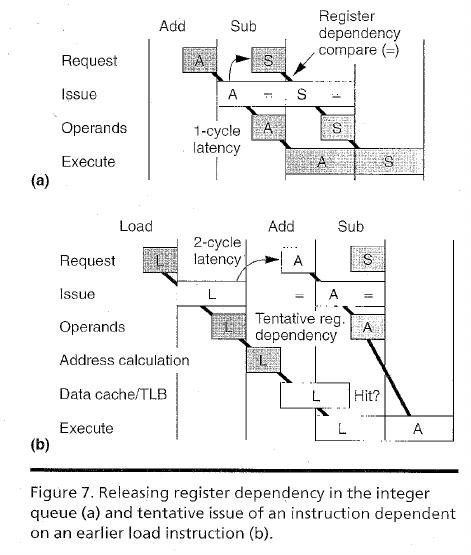

MIPS R10000是一个动态的，超标量的微处理器，实现了64位MIPS4指令集体系结构。每个周期取出并译码4条指令，然后动态地发射到5个完全流水线化的，低延迟的执行部件。指令可以越过跳转指令投机取出和执行。指令在完成后按序提交。虽然执行是乱序的，该处理器仍然提供内存顺序一致性和精确异常处理。

R1000的设计是为了高性能，甚至在有较差内存局部性的大型现实应用下。使用投机执行，它较早地计算内存地址和发起缓存填充。它的分层的非阻塞的内存系统使用两级的组相联的写回缓存，帮助隐藏了内存延迟。

乱序超标量处理器在本质上是复杂的。为了处理这种复杂性，R10000使用一种模块设计，将大量控制逻辑放在规则的结构里，包括活跃列表，寄存器映射表和指令队列。

#Design Rationale

R10000实现寄存器映射和非阻塞缓存，它们相互补足来覆盖缓存填充操作。<u>***因此，如果在缓存一个指令miss，它必须等待它的操作数填充到缓存，但是其他指令可以乱序继续执行。这增加了内存利用并且降低了有效的延迟，因为填充开始得早并且当处理器执行其他指令时，至多4个填充并行进行。这种类型的缓存设计叫做非阻塞，因为缓存填充不阻塞后续对其他缓存行的访问。***</u>

处理器至多提前看32条指令来找到可能的并行。指令窗口足够大来隐藏大多数的来自二级缓存填充造成的延迟。然而，它只能隐藏部分主存延迟，主存延迟通常远比二级缓存延迟长。

# Implementation

R10000微处理器在16.64*17.934毫米的片上使用0.35微米CMOS技术。这298mm^2^的片上包含680万个晶体管，包括440万在它的主缓存阵列。数据路径和时序要求严格的控制逻辑完全用户定制设计，充分利用了动态和锁存逻辑。使用基于寄存器的逻辑合成更少的关键的电路。

# System flexibility

可变的配置使R10000可以在广泛类型的系统中使用——作为一个单处理器或者在一个多处理器群中。系统保持缓存一致性使用监听或者目录协议。R10000的二级缓存大小范围是512KB至16MB。

# Operation overview

取指令流水线占了stage1到stage3。在stage1，R10000取出和校准接下来的4条指令。在stage2，它译码和重命名这些指令也为jump和branch指令计算目标地址。在stage3，它把重命名的指令写入队列然后读busy-bit表来判断操作数是否忙。指令在队列中等待直到所有操作数准备好。

当队列在stage3发射一条指令时，5个执行流水线开始。处理器在stage3的后半段从寄存器文件读操作数，然后在stage4开始执行。整数流水线占一个stage，load流水线占两个，浮点流水线占三个。处理器在下个stage的前半段将结果写入寄存器文件。

整数和浮点部件有独立的指令队列，寄存器文件和数据路径。这样可以降低最大线长度和允许完全并行操作。同时，两个独立的寄存器文件比联合共用的需要更多的空闲的寄存器，但是它们的面积更小，因为每个寄存器有更少的读写端口。

#Instruction Fetch

为了好的性能，处理器取指令和译码的指令带宽必须比执行指令的带宽高。

处理器在stage1取指令，如Figure3。指令缓存包含地址tag和数据段。为了实现两路组相联，每个数据段有两个并行的阵列。处理器用两个tag地址和转译的物理地址比较，从正确的路中选择出数据。一个小的八项的TLB是主TLB的子集。

***<u>处理器以任意字对齐从一个16字大小的指令缓存行中并行地取出四条指令。使用一个对缓存的读出放大器（读出放大器是从存储器读取数据时使用的读取电路的一部分; 它的作用是检测来自位线的低功率信号，该位线表示存储在[存储单元中](https://en.wikipedia.org/wiki/Computer_data_storage)的数据[位](https://en.wikipedia.org/wiki/Binary_digit)（1或0），并将小电压摆幅放大到可识别的[逻辑电平，](https://en.wikipedia.org/wiki/Logic_level)以便数据可以被存储器外部的逻辑正确解释）的简单的修改来实现该特征，如Figure4。</u>***

***<u>每个读出放大器在内存阵列中有4位列宽，一个4路选择器选择一列（代表一条指令）用于取指令。（？）</u>***R10000对每条指令使用一个独立的选择信号来取出不对齐的指令。如果需要的话，这些指令rotate，使这些指令可以按序译码。这个排序降低了依赖逻辑的数量。

通常，处理器在下个时钟周期译码所有的4条指令，除非指令队列或者avtive list满了。不立刻译码的指令保存在一个8字大小的指令缓存中，这简化了顺序取指令的时序。

#Branch Unit 

跳转指令经常发生并且必须快速执行。然而，处理器通常不能判断跳转方向直到译码该跳转指令的几个或者很多时钟周期后。因此，处理器预测一个条件跳转的方向并且投机地沿着预测的方向取出指令。预测器使用一个2位算法基于512项的跳转历史表。这个表以跳转指令的11:3位的地址作为索引。仿真显示对Spec92 Integer Program可以达到87%的预测准确率。

在MIPS架构中，处理器在执行目标地址的指令之前立刻执行jump或者branch之后的指令。在一个流水线的标量处理器中，当目标指令从缓存读取时，延迟槽指令可以被执行for free。这个技术在早期的RISC微处理器中提高了跳转的效率。然而，对一个超标量处理器来说，没有性能优势，但是为了兼容在R10000保留了该特性。

当程序执行发生了jump或者branch，处理器取消延迟槽外所有已经取出的指令。处理器载入jump的目标地址到PC然后一个时钟周期延迟后从缓存取出新的指令。这引入了一个“branch bubble” 周期，在这期间R10000不译码指令。

### Branch stack

当它译码一个跳转指令时，处理器将它的状态保存在一个含有4项的branch stack中。其中包含alternate跳转地址，全部的整数和浮点映射表的副本和各式各样的控制位。虽然这个栈像一个单独的逻辑部件一样操作，但是它在物理上分布在它复制的信息附近。

当branch stack满了，处理器继续译码直到它遇到下一条跳转指令。处理器译码然后暂停直到其中一条未定的跳转指令被解决。

### Branch verification

处理器当跳转指令的条件确定后立刻验证跳转预测是否正确，即使更早的跳转依然未定。如果预测不正确，处理器立刻取消所有沿着预测错误的路径取出的指令，然后从branch stack载入相应跳转指令的状态。

***沿着错误预测的路径取指令可能发起不需要的缓存重填。在这种情况下，指令缓存是非阻塞的，并且当这些重填结束处理器沿正确的路径取指令。结束这样的重填是不费力的和可取的，因为程序会立刻沿跳转的其他方向执行，例如在一个循环的结尾。***

一个4位的branch mask，对应于branch stack的项，在队列和执行流水线中伴随着每条指令。这个mask表示该指令依赖于那条未定的跳转指令。如果有跳转指令预测错误，当跳转决定被保留时处理器会取消该指令。不论何时R10000验证一条跳转指令，它会重置整条流水线中相应的mask。

#Decode logic

R10000在stage2并行地译码和映射4条指令，然后在stage3的开始将它们写入到合适的指令地队列。

如果active list或者队列满了，译码停止，但是几乎没有依赖于译码指令类型的译码限制。主要的例外包含整数乘和整数除指令。它们的结果写到两个特殊的寄存器——Hi和Lo。没有其他的指令有超过一个的结果寄存器。我们不对这些不常使用的指令增加太多的逻辑，而是使它们在active list中占两个槽。一旦处理器译码这样一条指令，它不在同一个周期译码后续的指令。（另外，它不译码整数乘和整数除作为一个周期中的第4条指令）。

读或者修改某个控制寄存器的指令串行地执行。处理器只能够当流水线是空的时候执行这些指令，这些指令大多数被限制在一些内核操作系统模式下的少数情况。这些限制对整体的性能几乎没有影响。

# Register mapping

Figure5描述了R10000的寄存器映射硬件。

为了乱序执行指令，处理器必须跟踪寄存器操作数，内存地址和控制位（控制位在状态寄存器中有8位，由浮点比较指令设置）的依赖关系。为了确定寄存器依赖，R10000使用寄存器重命名。它在address queue中确定内存地址依赖。如果值已知，它在译码期间设置每个控制位操作数。如果值不已知，它使用最终会设置该值的浮点比较指令的tag重命名该位。

从一个程序员的视角，指令按程序指定的顺序顺序地执行。当一个指令加载一个新的值到它的目的寄存器时，新的值对后续的指令立刻可用。然而，一个超标量处理器同时处理多条指令，它们的结果对后续的指令不是立即可用。通常，下一条后续的指令必须等待它的操作数有效，但是之后的指令的操作数可能已经可用。

R10000通过乱序执行之后的指令来达到高性能，但是重排序对程序员是不可见的。直到之前的所有指令都完成它乱序产生的任何结果都是暂时的。该指令graduate后，它的结果作为处理器状态被提交。直到graduate，如果一条指令之前的指令发生了异常或者预测错误，那么它可以被取消。它的逻辑目的寄存器之前的内容可以被恢复通过恢复它之前的映射。

在大多数处理器中，逻辑寄存器的标号和物理寄存器没有区别，逻辑寄存器标号在指令的域中被引用，物理寄存器是硬件寄存器文件的位置。每个指令域直接定位相应的寄存器。然而，我们的重命名策略动态地映射逻辑寄存器标号到物理寄存器标号。处理器写每个新的结果到一个新的物理寄存器。映射之后，处理器过比较物理寄存器标号简单地决定依赖通，它不再必须考虑指令顺序。同样，这些物理寄存器的存在和逻辑寄存器到物理寄存器的映射对程序员不可见。

R10000在处理之前指令的所有依赖后动态地执行指令。也就是说，每个指令必须等待直到它的操作数被计算。然后R10000可以执行该指令，不管原先的指令顺序。为了正确地执行指令，当每个操作数寄存器准备好时处理器必须确认。***<u>这可能很复杂，因为逻辑寄存器标号就操作数值而言是不明确的。例如，如果几条指定相同逻辑寄存器的指令同时在流水线中，寄存器可能重复加载不同的值。</u>***

物理寄存器的数量一定比逻辑寄存器多，因为物理寄存器包含被提交的值和指令的暂时的结果（已完成，未graduate）。一个逻辑寄存器也许有一系列的值当指令通过流水线时。不论何时一条指令修改一个寄存器，处理器分配一个新的物理寄存器给逻辑目的寄存器，然后在寄存器映射表中存储这些分配。当R10000译码指令时，它将逻辑寄存器域替换为相应的物理寄存器标号。

在从free list分配后每个物理寄存器被写一次。直到它被写，它一直是busy状态。如果一个后续的指令需要该值，那该指令必须等待直到它被写。在寄存器被写后，它处于ready状态，它的值不会改变。当一个后续的指令改变相应的逻辑寄存器时，结果被写入一个新的物理寄存器。当这个后续的指令graduate，程序不再需要旧的值，旧的物理寄存器变为free状态等待重新利用。因此，物理寄存器的总是有着不明确的值。

R10000有33个逻辑整数寄存器（1—31，Hi，Lo）和64个物理整数寄存器。（没有整数寄存器0。一个0操作数域意味着0的值，一个0目的域意味着结果不需要存储）。还有32个逻辑浮点寄存器（0—31）和64个物理浮点寄存器。

### Register map tables

独立的寄存器文件存储整数和浮点寄存器，处理器独立地重命名两类寄存器。整数和浮点映射表包含当前的逻辑到物理寄存器的分配。处理器使用5位的指令域选择逻辑寄存器。在相应的寄存器文件中6位的地址识别一个物理寄存器。

浮点表在一个32*6位的多端口RAM中映射寄存器f0—f31。整数表在一个33×6位的多端口RAM中映射寄存器r1—r31，Hi和Lo（对Hi和Lo寄存器有一个特殊的访问逻辑，Hi和Lo是整数乘除指令的不言明的目的寄存器）。

映射表有16个读端口和4个写端口，并行地映射4条指令。每条指令读这个映射得到3个操作数寄存器和一个目的寄存器。处理器将当前的操作数映射和新的目的映射写入指令队列，而active list保存着之前的目的映射。

R10000使用24个5位的比较器来在4条并行译码的指令之间探测依赖。这些比较器控制旁路的多路选择器，多路选择器用来自free list的新的分配来替换依赖的操作数。

### Free lists

整数和浮点free lists包含当前未分配的物理寄存器的列表。因为处理器并行地译码和graduate至多4条指令，所以这些列表由4个并行的，8深度的，循环的FIFO。

### Active list

active list记录当前所有在处理器中active的指令，当处理器译码指令时将该指令加入active list。当指令graduate或者发生预测错误和异常导致指令被取消时，将指令从active list中移除。因为至多32条指令处于active，所以active list包含4个并行的，8深度的，循环的FIFO。

每条指令使用5位tag标识，5位tag等于它在active list中的地址。当一个执行单元完成一条指令，它将指令的tag发到active list，active list将指令的done位置位。

active list为每条指令保存逻辑目的寄存器标号和它的旧的物理寄存器标号。一条指令的graduation提交它的新的映射，所以旧的物理寄存器可以返回free list来重新利用。

然而，当异常发生时，后续的指令不会graduate，而是处理器从active list恢复旧的映射。R10000每时钟周期取消4条指令的映射——以相反的顺序，以防它重命名相同的逻辑寄存器两次。虽然比恢复一个branch慢，但是异常的发生概率远比预测错误低。处理器通过恢复读指针来将新的物理寄存器返回到free lists。

### Busy-bit tables

对每个寄存器，整数和浮点busy-bit表包含一位表示寄存器当前是否有一个有效的值。每个表是一个64×1位的多端口RAM。当寄存器离开free lists时，表将相应的位置为busy。当一个执行单元将值写入寄存器时，重置该位。12个读端口判断4条新译码的指令3个操作数寄存器的状态。队列为特殊情况的指令使用3个其他的端口，例如整数和浮点寄存器之间的值复制。

# Instruction queues

R10000根据指令类型将每条译码的指令（除了jump和NOP）放入3个指令队列其中一个。队列如果有空间，那么可以接受任何新的指令的组合。

片的时钟周期限制队列的设计。每个被发射的指令有两个寄存器文件读端口来避免总线仲裁和总线多路选择操作数的延迟。

### Integer queue

整数队列不按明确的顺序包含16项，并且给每个译码的整数指令分配一项。当指令被发射到ALU时释放该项。

只有一个ALU可以执行的指令拥有对该ALU的优先权。因此，branch和shift指令对ALU1有优先权；整数乘法和除法指令拥有对ALU2的优先权。为了简化，指令在队列的位置而不是年龄决定发射的优先权。然而，一个轮询请求电路提升了请求ALU2的老指令的优先权。

图6显示了一个整数队列项的内容。

它包含3个操作数选择域，其中包含了物理寄存器标号。每个域包含一个ready位，从busy-bit表初始化。队列比较每个选择信号和对应整数寄存器文件写端口的目的选择信号。任意比较器匹配会置相应位ready。当所有的操作数ready，队列可以将指令发射到执行单元。

操作数C要么包含一个控制位值，要么包含将会设定该值的浮点比较指令的tag。总体上，每16项包含10个6位比较器。

队列将function code和立即数发射到执行单元。branch mask判断指令是否因为预测错误取消。tag在处理器完成该指令后置位active list中的done位。

整数指令的单周期延迟使integer queue的时序和逻辑变得复杂。在一个周期中，队列必须发射两条指令，探测哪个操作数ready，并且请求独立的指令。图7a阐述了该过程。

为了达成两周期的延迟，依赖于整数加载指令结果的指令必须被敏感地发射，而且假定加载指令会成功完成。当加载指令读数据缓存时，依赖的指令在它执行前的一个周期被发射。如果加载指令由于缓存miss或者依赖失败了，依赖的指令的发射会被取消。图7b解释了该过程。

### Address queue

地址队列包含16项，与其他两个队列不同，地址队列是一个保持原先程序指令顺序的循环FIFO。当处理器译码load或者store指令时，地址队列分配出一项；在指令graduate时，移除该项。队列使用指令顺序来判断内存依赖并且优先发射最旧的指令。

当处理器恢复一个误预测的branch时，地址队列通过恢复写指针来移除所有在branch之后译码的指令。

两个16-bit×16-bit的矩阵跟踪内存访问间的依赖。行和列对应于队列中的项。第一个矩阵通过跟踪哪些项访问了相同的缓存组来避免了不必要的cache thrashing。缓存组中任一的路可以被乱序执行的指令使用。但是如果两个或者更多的队列项访问同一个缓存组中不同的行，那么另一路留作最旧的访问该缓存组的项。第二个矩阵跟踪加载和未完成的store指令存储相同字节的指令。通过比较双字的地址和8位的字节掩码来决定该匹配。

### Float-point queue

浮点队列包含16项，与整数队列十分相似，但是不包含立即数。由于额外的接线延迟，浮点加载指令有3个周期的延迟。

# Register files

整数和浮点寄存器文件每个包含64个物理寄存器。执行单元直接从寄存器文件读操作数和写结果。虽然结果可能通过寄存器文件到达操作数寄存器，但是没有独立的结构，例如保留站或者reorder buffer。

整数寄存器文件有7个读端口和3个写端口。每个ALU专门有两个读端口和一个写端口，还有两个读端口专门用于地址计算单元。第七个读端口处理store，jump-register和move-to-floating-point指令。第三个写端口处理load，branch-and-link和move-from-floating-point指令。

一个单独的64字×1位的寄存器文件表示相应物理寄存器的值是否非零。它的三个写端口和整数寄存器文件并行地操作。两个读端口允许整数和浮点conditional-move指令检测一个单独的条件位而不是整个寄存器。这个寄存器文件比在大的寄存器文件添加两个读端口有更小的面积。

# Integer execution units

每个周期整数队列发射两条指令给整数执行单元。

### Integer ALUs

共有两个整数ALU，每个ALU包含一个64位的加法和一个逻辑单元。另外，ALU1包含一个64位shifter和branch condition逻辑，ALU2包含部分整数乘法和整数除法逻辑。图8显示了ALU1的模块图。

为了达到一周期延迟，寄存器文件的三个写端口旁路通过操作数寄存器。

### Integer multiplication and division

ALU2使用Booth算法，每次产生2位的乘数和2位的被乘数的部分积。该算法每个周期产生和累加4个部分积。

为了计算整数除法，ALU2使用一个每个周期产生一位的不恢复的算法。

Table1列出了通常的整数指令的延迟和重复率。

#Floating-point execution unit

图9展示了尾数的数据通路。加法器和乘法器有3状态的流水线。所有的单元都完全流水线化，只有一个周期的重复率。结果能够以两周期或者三周期的延迟绕过寄存器文件。所有的浮点操作都从浮点队列中发射。

# Memory hierarchy

内存延迟对处理器性能有着很大的影响。为了高效地跑大型程序，R10000实现了一个非阻塞的有着两层组相联缓存的内存层次。片上的指令和数据缓存同时操作，提供了低延迟和高带宽。片也控制大的外部的二级缓存。所有的缓存使用LRU替换算法。

主缓存都使用虚地址索引和物理地址tag。为了减小延迟，处理器可以访问每个主缓存同时在TLB进行地址转译。因为每个缓存路包含16KB（4倍最小虚页大小），两位虚地址索引（13:12）也许在物理地址tag不是等价的位。该技术简化了缓存设计。只要程序使用一致的虚地址索引来引用相同的页，那么该技术就可以工作得很好。处理器存储这虚地址的两位作为部分二级缓存的tag。二级缓存控制器检测任何冲突并且确保主缓存只保留每个缓存行的一个副本。

### Load/store unit

图10包含load/store单元和数据缓存的模块图。地址队列发射load和store指令到地址计算单元和数据缓存。当cache不忙时，一个load指令同时访问TLB，缓存tag阵列和缓存数据阵列。并行的访问使load的延迟为两个周期。 

### Address calculation

R10000虚地址的计算为两个64位寄存器的和或者一个寄存器和16位立即数的和。来自ALU或者数据缓存的结果可以绕过寄存器文件到达操作数寄存器。TLB将虚地址转换为物理地址。

### Memory address translation（TLB）

MIPS-4架构定义了64位寻址。实际的实现为了降低TLB和缓存tag阵列的开销减小了最大地址宽度。R10000的全相联TLB将44位虚地址翻译为40位的物理地址。R10000的TLB和R4000的类似，不过R10000的提高到了64项。每一项映射一对虚页并且独立地选择页大小（4的乘方，大于等于4KB小于等于16MB）。TLB由比较虚地址的内容寻址内存（CAM）和包含对应物理地址的RAM段组成。

