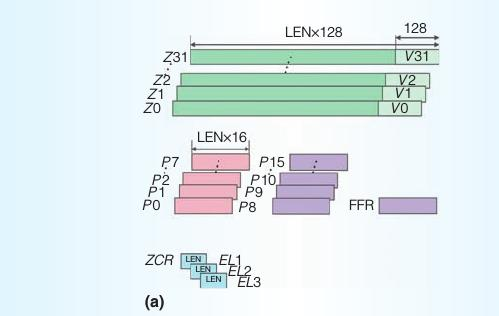
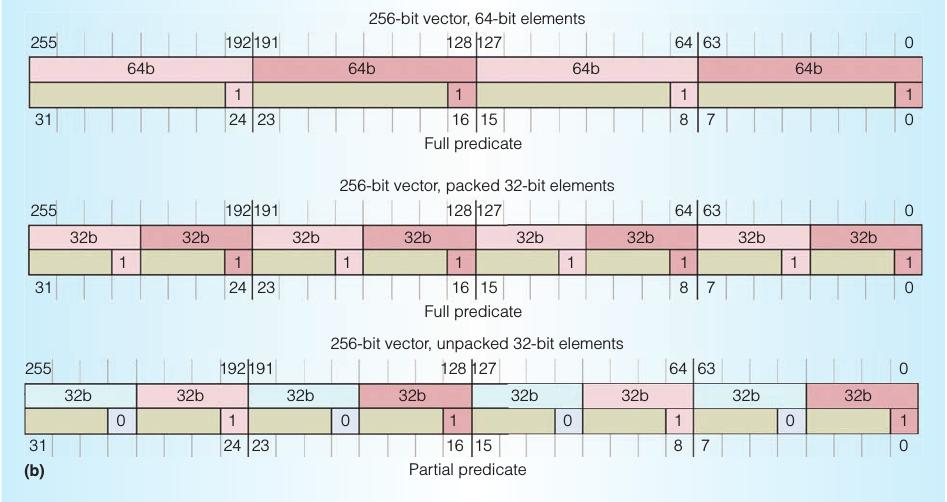
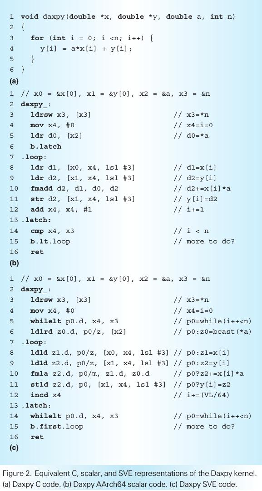
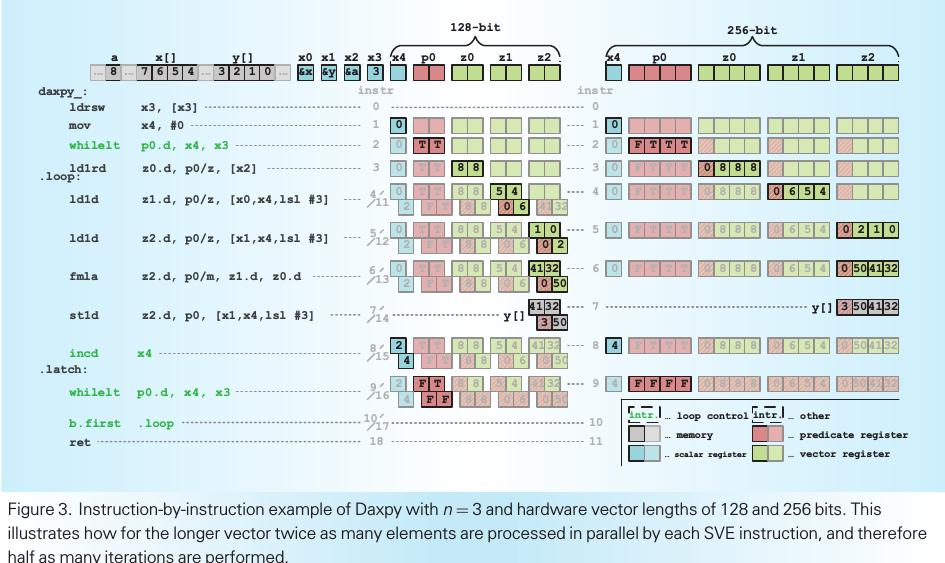
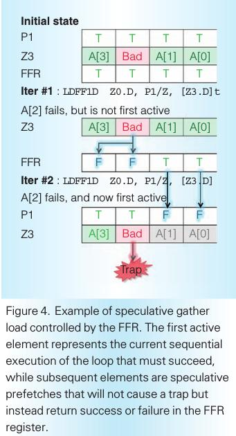
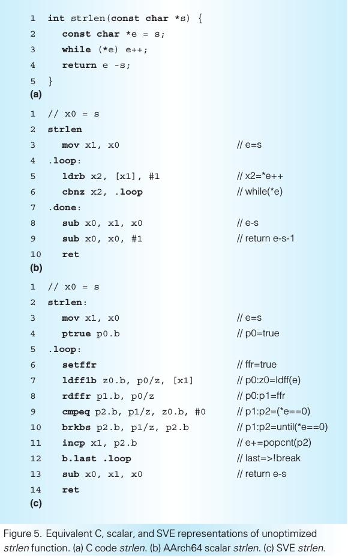
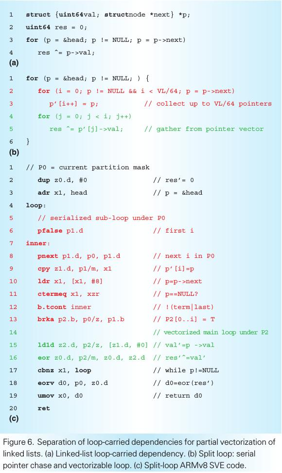
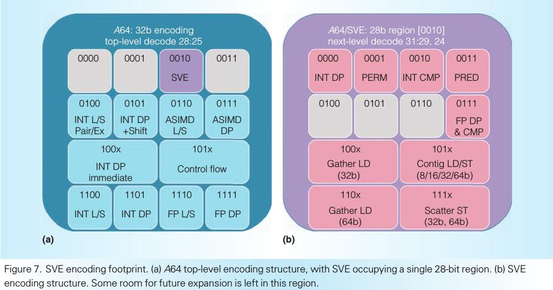
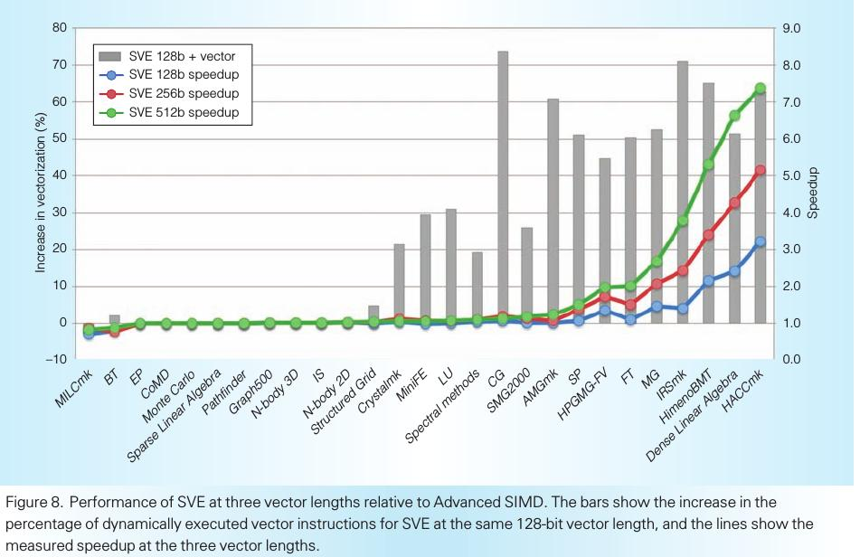

# THE ARM SCALABLE VECTOR EXTENSION

# SVE Overview

SVE可以选择从128位到2048位的向量长度，支持向量长度无关编程模型，使代码不需要重新编译就能够执行和自动拓展到所有向量长度。SVE引入了几个创新性的特征，开始克服一些自动向量化的传统困难。

在一个高的层次上，几个关键的SVE特征支持提高的自动向量化。

1. 可变的向量长度增加了并行度
2. 丰富的寻址模式导致非线性的数据访问和高效的循环展开
3. 每个车道的预测使循环向量化包含复杂的控制流
4. 预测驱动的循环控制管理降低了与标量代码有关的向量化开销
5. 丰富的水平操作集适用于更多类型的可归约的循环间依赖
6. 向量划分和软件管理的推断使有数据依赖的循环向量化可行
7. 标量化的向量内子循环允许有更复杂的循环间依赖的循环向量化

### Architectural State

SVE引入了

1. 32个新的可变长的寄存器（Z0-Z31），它们的宽度与执行相关，拓展了32个128位宽的Advanced SIMD 寄存器（V0-V31），可以容纳64,32,16,8位的数据元素。
2. 16个可变长的预测寄存器（P0-P15）和一个特殊目的寄存器first-fault Register（FFR）。
3. 控制寄存器（ZCR_EL1-ZCR_EL3）给有特权的执行状态虚拟化有效向量宽度的能力

### Scalable Vector Length

SVE允许每次执行选择一个128的倍数（在128到2048之间）的位数作为向量长度。

SVE通过使用向量划分来使软件向量长度无关，同时也支持更传统的SIMD编码方式。

### Predicate-Centric Approach

##### 16个可变长的预测寄存器（P0-P15）

通常的内存和算术操作被限制在P0到P7，P0-P7被叫做管理预测寄存器。

产生预测的指令（例如向量比较指令）和只用于预测的指令可以使用P0-P15。

##### 混合的元素大小控制

每64位的向量元素预测寄存器对应8个比特位，使控制可以达到字节粒度。对任意给定的向量元素，只有对应的管理预测寄存器元素的最低位用于控制。

##### 预测条件寄存器

SVE的产生预测的指令（例如向量比较和预测操作指令）重复利用AArch64 NZCV条件码标志寄存器，该寄存器在不同的预测上下文中被不同地解释。

##### 隐含的顺序

预测以隐含的从小端到大端的元素顺序被解释，对应于一个等价的顺序的执行。

##### 预测驱动的循环控制

预测用来驱动在SVE中的向量化的循环控制流决策。在其他的支持预测的SIMD架构，例如ICMI和AVX-512，为一个循环生成管理预测要求检测归纳变量。通常通过在向量寄存器中计算增加的值的序列，然后使用该向量寄存器作为向量比较的输入。

这种方式的开销有两个来源。第一，一个有价值的向量寄存器被浪费来存储序列；第二，自动向量化编译器以最大的元素大小来校准一个循环中的SIMD数据，当归纳变量的大小大于循环中处理的数据元素的大小时，可能会导致吞吐量损失。

为了在大多数通常情况下克服这些限制，SVE包含了一族while指令。while指令族使用标量计数和有限的寄存器来将已经被循环对应的顺序执行计算的预测用到循环迭代控制中。值得注意的是，如果循环计数器接近最大整数值，while指令可能会处理warp-around使其与原顺序代码的语义一致。

图2阐释了一些概念。图二以C语言，ARMv8-A标量汇编和ARMv8-A SVE汇编展示了一个固定步长的Daxpy循环。与图2b的等价的标量代码比较，在图2c中没有指令计数的开销，这样可以让编译器适时地向量化不知道行程计数的循环。

在图3中解释了相同的例子，它展示了128位和256位向量长度的SVE代码的每一步的执行，展示了中间的P预测寄存器和Z向量寄存器的状态和以两个向量长度处理4个数组元素的相关的指令。

### Speculation Vectorization

为了向量化有数据依赖结束条件的循环，软件不得不在条件确定之前投机执行。对于一些指令，例如整数算数指令，投机执行是无害的，因为没有边界效应。而对于有边间效应的指令，当操作不明确的数据和地址时，需要有相应的机制来避免边界效应。

SVE通过引入first-fault机制来向量化load指令。如果访存错误不是向量中第一个活跃元素造成的，那么first-fault会阻止该访存错误（活跃元素是指向量中相应的管理预测位为真的元素）。first-fault机制会更新FFR中的预测值来表示哪个元素在内存错误后没有成功地载入寄存器。

图4展示了一个gather load投机加载Z3寄存器地址的值的例子。在第一次迭代中，FFR初始化为真。A[0]和A[1]的地址转译成功，而A[2]无效（比如没有映射），然后它加载失败但没有发生trap，而是FFR中对应于A[2]和A[3]的位置被设为假。在第二次迭代中，指令预测寄存器P1中对应于A[0]和A[1]的位置设为假，FFR全部被设为真。在这种情况下，A[2]再次加载失败——但是，因为现在它是第一个活跃元素，它会在操作系统中导致一次陷阱来处理这次错误或者结束程序如果它是一次非法访问。

图5展示了使用first-fault机制的投机向量化如何向量化strlen函数。ldff1b指令加载s中的字符，然后将从first-fault地址开始的FFR元素设为假，所以只有成功加载的元素在FFR中保持为真。FFR预测值转移到P1，P1作为后续指令的预测寄存器，后续指令检查是否为字符串结束字符。紧跟着一个内存错误，下一个循环会重试错误访问，但是现在是作为第一个活跃元素，这会导致陷阱，陷阱交给操作系统处理。

### Dynamic Exits

接下来说明SVE如何向量化一个没有明确迭代计数的循环。使用的技术叫做向量划分，它由对应于动态循环条件的基于安全元素划分的操作组成。

使用预测操作指令实行划分，划分被嵌套的条件和循环继承。向量化的代码必须保证按原先循环顺序执行的紧跟着循环跳出的有边界效应的操作必须不被执行。这通过生成一个循环跳出之前的向量划分来实现，只在划分上进行操作，如果跳出条件在向量中被探测出来，那么结束循环。

图5显示了如何使用向量划分来向量化strlen函数。已经描述了ldff1b指令如何投机地加载值。rdffr指令报告被安全加载的值的划分。cmpeq指令使用这个划分来比较安全的（有效的）值和0是否相等。然后，brkbs指令生成一个被循环跳出条件限制的子划分，并且设置last（C）条件标志。

### Horizontal Operations

另一个SIMD向量化的挑战是在同一向量中的循环迭代间的依赖，特别是当向量长度没有提前知道。在许多情况下，这些依赖可以通过使用水平向量归纳操作来解决。不像通常的SIMD指令，水平操作是同一向量寄存器中的元素的水平地执行操作的一类特殊的指令。SVE提供了丰富的水平操作集，包含位逻辑，整数和浮点归纳。

### Scalarized Intravector Subloops

更复杂的循环间依赖是向量化的一个重要的障碍，SVE可以帮助解决。一个克服的方法是使用循环分裂来将一个循环划分为一个明确串行的部分，使剩余的循环可以有利地向量化。然而，在许多情况，解包和打包向量来串行地执行的开销会降低向量化的性能提升。为了降低开销，SVE为在向量划分中串行地处理元素提供了支持。

这个问题的例子是遍历一个链表，因为在每次迭代间存在循环间依赖（如图6-a）。通过应用循环分裂，循环被分成一个串行的指针追赶，然后是一个向量化的循环（如图6-b）。

图6c显示SVE如何向量化该代码。第一部分是串行化的指针追赶。pnext指令允许在活跃元素上一个接一个地将p1设为下一个活跃元素并且计算last条件码。cpy指令将标量寄存器X1插入到向量寄存器Z1的对应位置。然后，ctremeq指令探测链表的结束（p==NULL）或者向量结束（通过检测被pnext指令设置的last条件）。b.tcont跳转检测，然后如果有更多指针可用，那么继续该串行的循环。

被加载的指针的划分计算后放入P2。在这种情况下，向量化的循环只执行一次异或操作。最后，Z0中的所有向量元素使用eorv指令进行水平的异或归约操作。在这个例子中，得到的性能也许不够充分来证明使用循环向量化的正当性，但是它是用来阐述一个主要的可应用于更有益的情景。

# Compiling for SVE

由于宽向量，向量长度无关，预测和使用first-fault加载的投机向量化的影响，将这些技术加入到编译器需要重新思考编译策略。

### Wide Vectors and Vector-Length Agnosticism

由于向量长度在编译期不可知，所以解决方案是直接将标量操作映射为对应的向量操作。第二个挑战是常量向量长度VL通常对向量化至关重要。例如，当处理归纳变量时，编译器可能通过从内存加载初始化一个向量值为[0,1,...,VL-1]，然后每次迭代增加VL。SVE使用一族指令来解决这个问题，在这些指令中当前向量长度是一个隐含的参数——例如，index指令初始化一个向量归纳变量然后inc指令基于当前的向量长度和指定的元素大小来改变归纳变量。 

向量长度无关也对寄存器栈的读写有影响，例如由于寄存器不足导致的溢出或者传递向量参数作为部分函数调用的约定。在一个已经存在的编译器中支持该技术十分具有挑战性，因为编译器一般假定所有的对象在栈帧中有一个常量的偏移，这和可变的长度向量寄存器的情况不符。对于已经存在的栈区域，偏移保持固定（比如，常数的字节偏移），但是包含SVE寄存器的区域被动态地分配，并且向量寄存器load/store指令的偏移会编码一个“stack slot number”，“stack slot number” 会被自动乘上向量长度的字节数。

### Predication

通过插入一条brk指令，生成向量划分，紧跟着循环结束条件的那些车道不再活跃，拓展“if conversion” pass方式来处理跳出循环的条件跳转。

### Floating Point

对于编译器向量化来说，由于向量化循环可能会改变浮点操作的顺序，导致产生和标量代码不同的结果，所以浮点操作是一个挑战。程序员不得不选择是取消向量化来产生一致的结果还是忍受一些误差来达到更高的性能。

因为不同的向量长度可能导致不同的顺序而产生不同的结果，所以向量长度无关引入了更多的变数。SVE通过提供一个严格顺序地fadda归纳来减缓这种情况，fadda归纳让编译器向量化循环，其中原本的浮点加法的顺序为了正确必须被保持原样。

### Speculative Vectorization

所有的改变的实现都是作为LLVM编译器已存在的向量化pass的拓展，但是在该结构下支持投机向量化是不可行的。因此，在一个单独的pass中实现投机向量化，该pass目的是扩展循环覆盖率而不是产生高质量的代码。 

新的向量化在大多数情况下和LLVM当前的向量化以相同方式工作，但是新的向量化有更先进的预测处理来支持有多个出口的玄幻。它将循环划分为多个区域，每个在不同的预测寄存器的控制下。广泛地说，这些区域表示总是可以安全执行的操作，被要求计算条件结束预测的指令和在条件结束之后的指令。对于后两个区域，使用first-fault加载和划分操作。

# Design Challenge

1. Constructive versus Destructive Forms

   SVE的权衡是大多数数据处理提供非结构性的预测的格式，只有最基础的操作码提供结构性的非预测的格式。

2. Move Prefix

   为了满足完全结构化的和预测的指令的偶尔的需要，SVE引入了movprfx指令，硬件可以很简单的译码该指令并且将它和下一条指令结合在一起来创造一条结构化的指令。

3. Restricted Access to Predicate Registers

   为了减少编码空间，预测加载，预测存储和数据处理指令使用管理寄存器P0-P7，预测产生指令可以使用全部的16个预测寄存器。

4. Hardware Implementation Cost

# SVE Performance

在图8的左侧，我们可以看到在这些测试基准上，向量利用率很小甚至为0。研究发现这是因为代码结构化的方式的或者编译器的限制而不是架构的缺点。