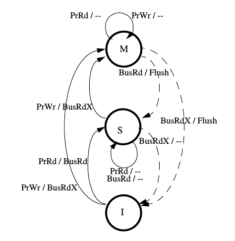
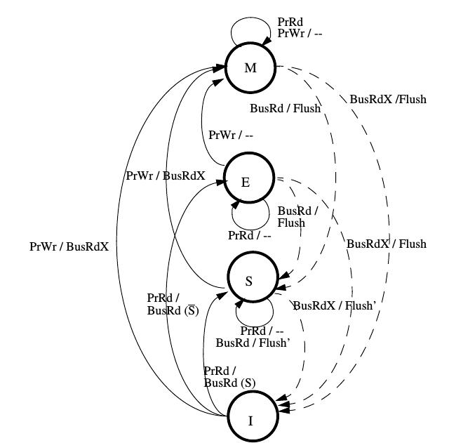
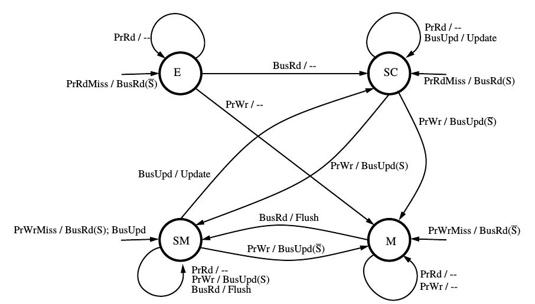
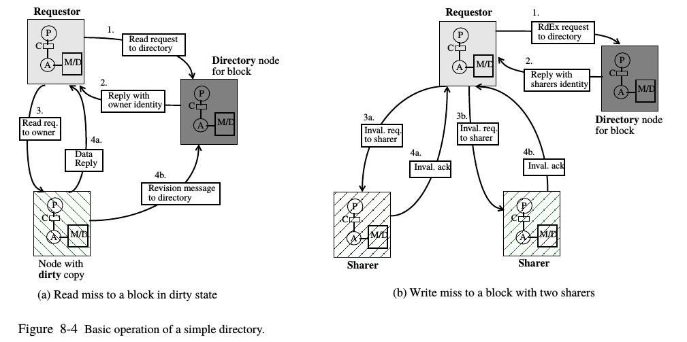
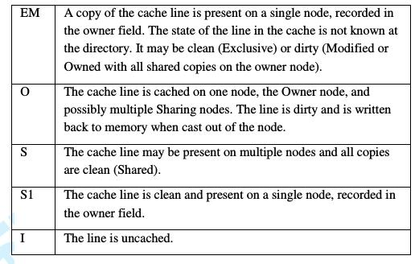
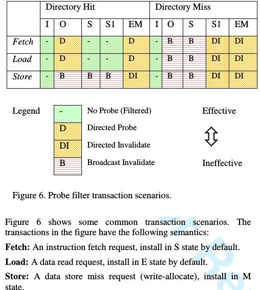

###1.什么是并行计算，主要用于解决什么问题？

### 2.什么是并行计算体系结构?

Given that a parallel computer is “a collection of processing elements that communicate and
cooperate to solve large problems fast,” we may reasonably view parallel architecture as the
extension of conventional computer architecture to address issues of communication and cooper-
ation among processing elements. In essence, parallel architecture extends the usual concepts of
a computer architecture with a communication architecture.

### 3.并行编程有哪些主要语言和模型？

Three major modern programming models introduced in Chapter 1: shared address space, message passing, and data parallel. 

MPI，pthread，openmp，cuda，High-Performance Fortran.

### 4.多核和多处理器设计有哪些关键技术？

### 5.cache一致性协议用于解决什么问题，存储一致性模型用于解决什么问题？

cahce一致性模型解决的问题（coherence其实保证的就是对**某一个地址**的读操作返回的值一定是那个地址的最新值：

处理器A与处理器B分别拥有地址为A的数据的缓存D0。当T1时刻，处理器A修改了D0为D1，但是没有写回主存。当T2时刻，处理器B取地址A的数据并将其+1。当T3时候，处理器A与处理器B都进行写回。

这个简单的流程中，出现了几个严重的问题：

- 在T2时刻，处理器B读取地址A的数据不是最新的数据。
- 在T3时刻，如果没有一个一致性协议来维护的话，这时候就出现了三个版本的地址A的值：`D1,D0~1,D0`。写回后也无法预测内容中保存的值为多少。

存储一致性模型：

写入值**多久后**能确保被读取操作读取到，是memory consistency讨论的问题。

### 6.侦听协议和目录协议怎么实现的？

The four states are valid-exclusive (E), shared-clean (SC), shared-modified (SM), and modified (M). There is no invalid (I) state because the update protocol always keeps blocks in the cache up-to-date.

A read miss by processor i goes to memory and is handled as follows:

* If the dirty bit is OFF , then the controller obtains the block from main memory, supplies it to the requestor in a reply network transaction, and turns the ith presence bit, presence[i], ON.

* If the dirty bit is ON, then the controller replies to the requestor with the identity of the node whose presence bit is ON, i.e. the owner or dirty node. The requestor then sends a request network transaction to that owner node. At the owner, the cache changes its state to shared, and supplies the block to both the requesting node, which stores the block in its cache in shared state, as well as to main memory at the home node. At memory, the dirty bit is turned OFF , and presence[i] is turned ON. 

  A write miss by processor i goes to memory and is handled as follows:

* If the dirty bit is OFF , then main memory has a clean copy of the data. Invalidation request transactions are sent to all nodes j for which presence[j] is ON. The directory controller waits for invalidation acknowledgment transactions from these processors—indicating that the write has completed with respect to them—and then supplies the block to node i where it is placed in the cache in dirty state. The directory entry is cleared, leaving only presence[i] and the dirty bit ON. If the request is an upgrade instead of a read-exclusive, an acknowledgment is returned to the requestor instead of the data itself. 
* If the dirty bit is ON, then the block is first recalled from the dirty node (whose presence bit is ON), using network transactions. That cache changes its state to invalid, and then the block is supplied to the requesting processor which places the block in its cache in dirty state. The directory entry is cleared, leaving only presence[i] and the dirty bit ON.

### 7.现代多处理器设计主要采用什么技术？

超大规模集成电路， the VLSI technology trends are likely to encourage the design of processors that are both more insulated from the memory system and more flexible, so that they can adapt to the behavior of the memory system. This bodes well for parallel computer architecture, because the processor component is likely to become increasingly robust to infrequent long latency operations.

多线程，There are strong indications that multithreading will be utilized in future processor generations to
hide the latency of local memory access.

光刻制造技术，Link and switch bandwidths are increasing, although this phenomenon does not have the smooth evolution of CMOS under improving lithography and fabrication techniques。

交换网络，目录缓存一致性协议，Essentially all systems will be constructed as SMPs, even if only one processor is attached. Increasingly, the bus is being replaced by a switch and the snooping protocols are being replaced by directories.

PCI，Higher speed networks are a dominant concern for current I/O subsystems, as well. There has
been a great deal of attention paid to improved I/O support, with PCI replacing traditional vendor I/O busses.

### 8.多路芯片通讯中消息有哪些？

### 9.为什么需要消息过滤？

降低总线带宽需求。

### 10.Operon芯片目录一致性协议怎么实现的？

### 3.2 Description of directory protocol

HT Assit增加了一个缓存目录：每个home node跟综来自它自身的内存的哪些缓存行被系统的其他处理器缓存。目录完全包含系统中被缓存的数据。如果一个缓存行在缓存中，那么在home node的目录中一定有对应的目录项来表示该缓存行被缓存。如果一个目录满了，或者发生映射冲突，一个之前的目录项会被替换来响应新的请求（可能造成写回和所有缓存中之前目录项数据的无效）

事务流和广播协议非常相似。发起的请求到达home node，然后被排序和激活。一旦一个请求被激活，它不会广播探测，而是同时开始访问DRAM和探测过滤查询来减小通常情况下的DRAM延迟。当目录查询结束，发起广播探测或者针对的探测（一个探测目标只有一个处理器）或者没有探测被发起，这取决于目录状态。访问探测过滤器然后发起一个针对探测的时间叫做“间接延迟”。当一个针对探测被发起，协议保证不会要求DRAM回应，然后DRAM回应被取消。当没有探测被发起，内存响应的数据表示期望这是唯一的响应，并且这个请求已被完成。广播探测和之前的广播协议有相似的数据流，除了这代的协议保证数据会从owner node返回。

对于大多的请求，目录状态会在基于请求类型和目录状态的目录查询后被立刻更新。对于一些请求，例如写S状态的行，请求总是按广播处理，并且目录查询和更新被延后直到请求结束。在所有情况，若只要求一个单独的目录查询和更新，那么它们被按原子性的读-修改-写操作处理。按这种方式设计协议极大地简化了微体系结构设计和协议复杂性。

作为部分的目录协议操作，alternate CPU的缓存（L1，L2，L3）的一致性行为必须被使用。值得注意的是，外部的读探测请求必须将E状态的缓存行变为O状态然后将数据返回给请求者，然后E状态缓存行的换出通知被发送给目录。

### 3.3 Directory storage

 The normalized address is used to reduce the number of tag bits required and allows the directory structure to be sized based on the maximum DRAM per node, not the total DRAM across all nodes in a system.（？）

The tag field tracks normalized addresses (i.e., the DRAM base address of the home node is subtracted (or, for node-interleaved addressing, appropriate bits of the system physical address are removed) before the resulting address is stored in the directory.

### 3.4 Directory l states and transitions

##### 3.4.1 Directory behavior

目录缺失可能发现对应的目录索引已经充满了有效项，因此其中一项会被新项换出。我们叫这种情况为downgrade probe（降级探测）；这种探测导致一次写回（如果换出项为脏）并且无效被降级的缓存行的所有存在的缓存副本。

There are no notifications of S-state castouts in the protocol. S-state lines in the directory are reclaimed via downgrade probes. S-state evictions were omitted for a number of reasons, due both to performance (potentially large number of eviction messages) and various microarchitecture-specific
implementation complexities. Performance evaluation showed that S-state eviction notifications were not critical for achieving acceptable directory performance.